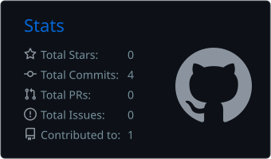
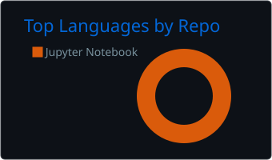

# Olá, eu sou Bruno Serpa 👋

### Desenvolvedor Back-end Trainee na Graúna

Tecnólogo em **Desenvolvimento de Software Multiplataforma** pela  
**Fatec de São José dos Campos — Prof. Jessen Vidal**

 

---

## 👨‍💻 Sobre mim

Sou **Desenvolvedor Back-end Trainee na Graúna** e tecnólogo em Desenvolvimento de Software Multiplataforma pela Fatec de São José dos Campos.

Atuo no desenvolvimento e na manutenção de soluções back-end, aplicando conhecimentos de programação, APIs, bancos de dados, versionamento e boas práticas de desenvolvimento de software.

Também utilizo este espaço para compartilhar projetos profissionais, acadêmicos e pessoais que representam minha evolução como desenvolvedor.

- 💼 Desenvolvedor Back-end Trainee na Graúna
- 🎓 Tecnólogo em Desenvolvimento de Software Multiplataforma
- ⚙️ Foco em desenvolvimento back-end, APIs e bancos de dados
- 🌱 Em constante aprimoramento técnico e profissional
- 📍 São José dos Campos, São Paulo

---

## 🛠️ Competências técnicas

### Linguagens

  

### Frameworks e tecnologias

  

### Bancos de dados

  

### Ferramentas e plataformas

  

---

## 🚀 Atuação profissional

Atualmente, atuo como **Desenvolvedor Back-end Trainee na Graúna**, colaborando com o desenvolvimento, a manutenção e a evolução de sistemas e serviços.

Meus principais interesses profissionais incluem:

- Desenvolvimento e manutenção de aplicações back-end;
- Construção e integração de APIs;
- Modelagem e utilização de bancos de dados;
- Qualidade, organização e manutenção de código;
- Versionamento e colaboração com Git;
- Arquitetura e integração de sistemas;
- Aprendizado contínuo de tecnologias e boas práticas.

---

## 📊 Estatísticas profissionais

  
  

  

---

## 🧑‍💻 Atividade no perfil pessoal

Parte do meu histórico de estudos, projetos acadêmicos e experimentos está disponível no meu perfil pessoal [`BrunoSerpa`](https://github.com/BrunoSerpa).

  
  

  

  

---

## 📫 Vamos conversar?

Estou disponível para trocar experiências, compartilhar conhecimentos e conversar sobre tecnologia e desenvolvimento de software.

  
  

  <a href="#inicio">Voltar ao início ↑</a>

